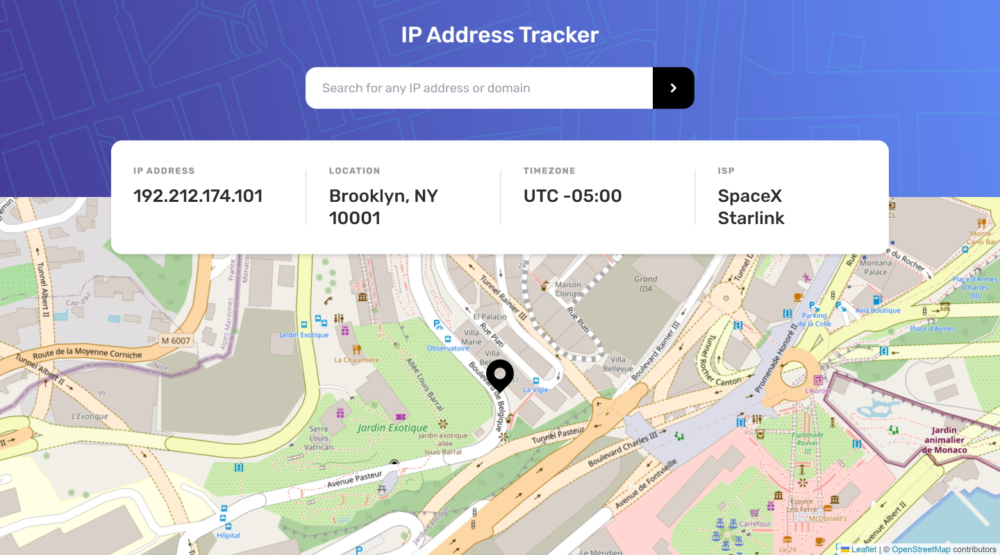

# Frontend Mentor - IP address tracker solution

This is a solution to the [IP address tracker challenge on Frontend Mentor](https://www.frontendmentor.io/challenges/ip-address-tracker-I8-0yYAH0). Frontend Mentor challenges help you improve your coding skills by building realistic projects.

## Table of contents

- [Overview](#overview)
  - [The challenge](#the-challenge)
  - [Screenshot](#screenshot)
  - [Links](#links)
- [My process](#my-process)
  - [Built with](#built-with)
  - [Useful resources](#useful-resources)
- [Author](#author)

## Overview

### The challenge

Users should be able to:

- View the optimal layout for each page depending on their device's screen size
- See hover states for all interactive elements on the page
- See their own IP address on the map on the initial page load
- Search for any IP addresses or domains and see the key information and location

### Screenshot

### Links

- Solution URL: [https://www.frontendmentor.io/solutions/ip-address-tracker-using-nextjs-13-uvNkPJ8w-k](https://www.frontendmentor.io/solutions/ip-address-tracker-using-nextjs-13-uvNkPJ8w-k)
- Live Site URL: [https://next-ip-tracker-ten.vercel.app/](https://next-ip-tracker-ten.vercel.app/)

## My process

### Built with

- [React](https://reactjs.org/)
- [Typescript](https://www.typescriptlang.org/)
- [Next.js](https://nextjs.org/)
- [Tailwind CSS](https://tailwindcss.com/)
- [IP Geolocation API by IPify](https://geo.ipify.org/)
- [LeafletJS](https://leafletjs.com/)
- [React Leaflet](https://react-leaflet.js.org/)

### Useful resources

- [_Making React-Leaflet work with NextJS_](https://placekit.io/blog/articles/making-react-leaflet-work-with-nextjs-493i) - This blog post helped in getting React Leaflet to render within a client component.

## Author

- Website - [Antonio Mercado](https://amdev.work)
- Frontend Mentor - [@antmercado94](https://www.frontendmentor.io/profile/antmercado94)
- Twitter - [@FirstFoodShop](https://www.twitter.com/firstfoodshop)
